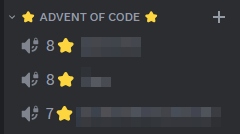

# AoC Discord Leaderboard

A Discord bot that fetches a private leaderboard from Advent of Code and shows in the form of Discord channels. Updates every 15 minutes.



The sorting is currently only based on the amount of stars, and tie-breakers are not implemented. And the overall code is not very good, but it does what we needed at the moment.

## Requirements:
### To install:
```
pip install discord
pip install requests
pip install python-decouple 
```
### Discord server
The voice channels used by this bot needs to be created manually. The IDs for the channels then need to be added to the .env file

### .env file:
```
session_cookie=SESSION_COOKIE
url=LEADERBOARD_JSON_URL
discord_token=DISCORD_TOKEN
discord_guild=GUILD_ID
discord_channel1=CHANNEL_ID
discord_channel2=CHANNEL_ID
discord_channel3=CHANNEL_ID
```
### Bot Permissions
Bot needs enough permissions on your Discord server to edit the names of the channels in question

### To run
`python main.py`
